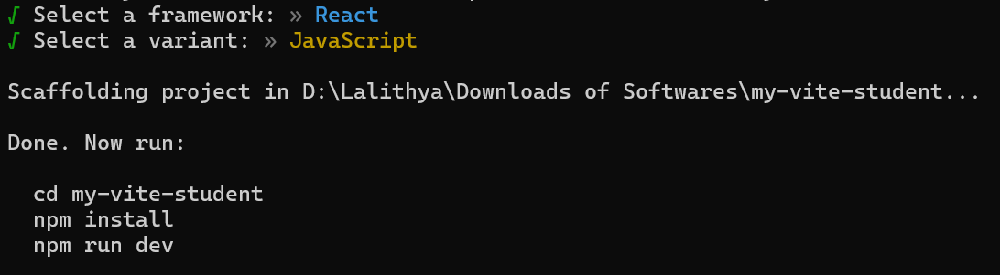
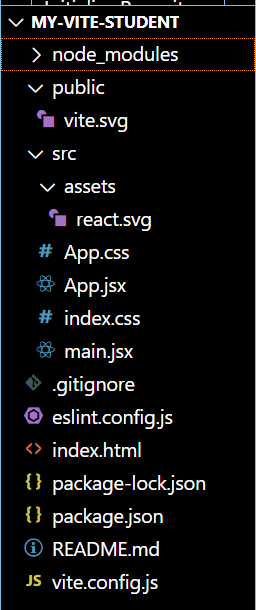
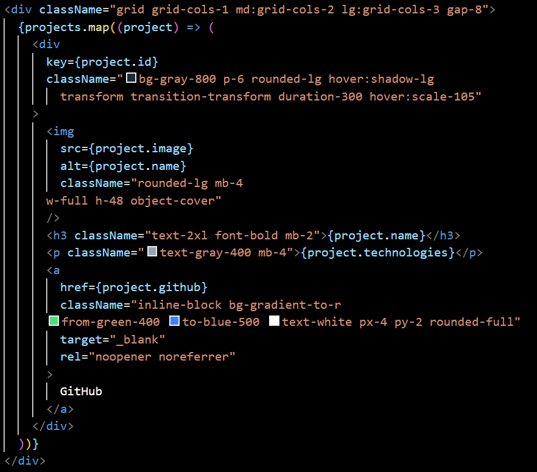

## How to set up a React project using Vite

Install Node.js if you have not done so.
Open Node.js command prompt (or your computer's terminal)
Go to the directory you want to put your React project at (cd 'folder name' to navigate there, and mkdir to create a new folder/directory)

Create new Vite project using the following command:
npm create vite@latest your-react-projectname

For framework, choose React:

For variant, choose Javascript:

Once that is selected and done, you should get this in your command prompt:

Now go to your react project using cd your-react-projectname and type the following command:
npm install

Open the folder in VSC. Your files should look like this

## How to set up Tailwind CSS in React project

In your Node.js, type the following commands:
npm install -D tailwindcss postcss autoprefixer
npx tailwindcss init -p

This should generate your 'tailwind.config.js' and 'postcss.config.js' files.

Configure your template files in 'tailwind.config.js' file. Add the highlighted portion in content

Add the following @tailwind directives to your ./src/index.css file.

@tailwind base;

@tailwind components;

@tailwind utilities;

Your folder should now look like this:

Additional items to set up for React-portfolio:

npm install react-icons

npm install @emailjs/browser

Create a free account on EmailJS website

## Activity 1: How to set-up a component in React

1. Create a components folder in src folder
2. Create a .jsx file in the components folder
3. Write your code in the file
4. Export the component
5. Import the component in App.css
6. Call for component in App function

In this case, we will use the Navigation bar as the demo for this
Create a components folder in src folder
Create a NavBar.jsx file in the components folder
Code breakdown:

Start with this code template:
import React from 'react'

function Navbar() {
return (

`
Navbar
`
)
}

export default Navbar

Since we are creating a Navigation bar, we can use a `<nav>` tag instead of a `
` tag. Inside the `<nav>` we start adding `
` CSS classes to style the Navbar. Take note that since we are writing in JSX, the syntax for the HTML elements are different, so instead of the typically used 'class' in HTML, we use 'className'.

#### How to use Tailwind CSS in your code:

For example, in the `<nav>` tag:

`<nav className="bg-black text-white py-4">`
`
`

`
`
`</nav>`

**bg-black:** Sets background colour to black
**text-white:** Makes the text white.
**py-4:** Adds padding on the top and bottom.

Then in the next `
` tag and class created,

**container mx-auto:** Centers the content and limits its width.
**flex justify-between items-center:** Creates a horizontal layout with space between items and vertical alignment.

and so on.

#### How to set up links to various parts of your portfolio page

For navigation, `<a>` are usually used, with a href attribute pointing to a section of the page. The section needs to have an id in its `
` tag so that browser knows where to navigate when the link is clicked

In this case, we will use the Service portion as an example for how to setup links.
Put 'id=service' in the first `
` tag of the Service component . It should look like this:

`
`

Back in the Navbar component, type the id name given for the href attribute for Service link:
`<a href="#service" className="hover:text-gray-400">`
Service
`</a>`

And from here it should start working. Make sure that the spelling in the id given in Service component and in the href matches up.

Once you are done, export the component as 'export default Navbar'.

In App.jsx, clear code written in the return statement
import Navbar component as Navbar, write down the file path for it to be imported from
Call for it in the App function

And your Navbar should be displayed and working!

## Activity 2: How to dynamically generate cards using arrays and map function

For explanation: Experience.jsx
I want to display my skills in certain categories, but I don't want to hard-code them.
So instead I will put the data in an array, and get them generated dynamically by using the map function

An array of objects named experienceData is created. Each object has the category i want (e.g. front-end or back-end), as well as an array of objects for skills, which in turn contain skill name and level for each object.

Then, the map() function is used in return statement, looping over each object in the experienceData array, creating a `
` for each category. Category name dynamically created and displayed using {category.category}

Similarly, another map function is used (inside the map function used for category) for skills, looping over each object in the skills array, creating an `<article>` for each skill.

Demo: Projects.jsx

Now that we have an idea of how to utilise the map function in React, lets try an example in Projects.jsx. An array has already been provided to you with the id, name and technologies filled in. Can you:
a) write a map function in the return statement that would get the title of the project and a paragraph about the technologies rendered and shown.
b) add 2 new properties called image and github to the array, where you need to put an image and github link respectively

The CSS has already been written for you, so you only need to figure out how to implement the map function then how to add on to it
Answer:

Note: We are using `<a>` tag for github button instead of `<button>` since it requires navigation to another website

## Activity 3: How to set up a functional Contact form using EmailJS

If you have not already done so, please create a EmailJS account and install @email/browser.

Log in and click on Email services. Create a new service, select the email service you want to use and connect your account to it.

Next, create a template. Remember that for whatever arrangement you have, you need to put the name, email and message fields as {{name}}, {{email}} and {{message}} respectively to match the name attributes in the form fields

Now, take note of your service id (in the email service created), your template id(in the email template you created), and your public key (under Account)

Paste them into placeholder text in the Contact component (taken from here [React EmailJS Docs](https://www.emailjs.com/docs/examples/reactjs/))

Finally, add 'ref={form} onSubmit={sendEmail}' in the `<form>` element and you're done! You should now be able to send messages from your contact form to your preferred email
